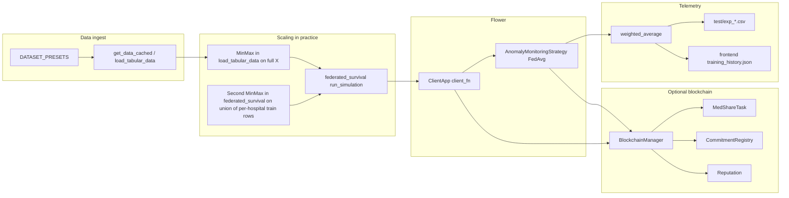

# MedShare project comprehension (logic files)

Deep read-only reference: how Python FL, Solidity, the Vite dashboard, and JSON artifacts connect. This doc reflects the **current** logic in the repository (not marketing copy elsewhere).

## What this project is

**MedShare** bundles three concerns:

1. **Federated learning** — Flower (`flwr`) + PyTorch tabular classifier (`SurvivalMLP`), optional Opacus DP, optional gradient/label attacks, optional Robust-MAD filtering, optional pairwise masking (`--enable_secagg`).
2. **Local Ethereum** — Web3.py in Python (`medshare/blockchain.py`), ethers v6 in the browser (`frontend/src/blockchain.js`). ABIs and addresses under `build/`; UI copies in `frontend/src/data/`.
3. **Dashboard** — Vite SPA shell (`frontend/index.html`) + vanilla modules for charts, marketplace state, and chain I/O.

Most public demos also rely on **checked-in JSON** under `frontend/src/data/` (`*_audit.json`, baselines, histories). Live runs overwrite or supplement `baseline.json`, `comparison_stats.json`, `training_history.json`.

---

## End-to-end data flow (logic)

---

## `federated_survival.py` (orchestrator)

**Role:** Single CLI entry for simulations and experiment sweeps.

**High-level sequence in `run_simulation`:**

1. **`reset_logging()`** — clears round cache used for MI bridging in `utils.py`.
2. **Optional delete** `frontend/src/data/training_history.json` for a clean UI curve.
3. **`get_data_cached(config)`** — returns `X, y, parts, dim, classes`. Note: `load_tabular_data` already applies a **global** `MinMaxScaler` on feature matrix `X` (see `medshare/data.py`).
4. **Second scaler (simulation alignment):** builds `train_indices` by taking each hospital partition’s 80% train indices (same `random_state=42`), **`scaler.fit(X.loc[train_indices])`**, then:
   - **`get_centralized_performance(..., fitted_scaler=scaler)`** so the centralized baseline uses the **same** scaler as FL.
   - Per-hospital **`train_test_split`** on **`scaler.transform(X.loc[parts==n])`**.
5. **Reputation gatekeeper** (if `enable_blockchain`): `rep = get_reputation(i)`, `score = rep - 100`, keep hospital iff **`score >= 0`** (aligned with Solidity payout filter).
 **`names`** = authorized partition labels; FL uses only those.
6. **Blockchain demo hook:** if chain on, **`create_task_with_bounty`**, **`join_task`** for all except **first** listed hospital (reserved for manual dashboard join), then **busy-wait** until on-chain task status becomes **Training** (tuple index 5), or Ctrl+C bypass.
7. **`AnomalyMonitoringStrategy`** instantiated with **`net=SurvivalMLP(dim, classes)`** so checkpoints can save a proper **`state_dict`**.
8. **`generate_pairwise_masks`** if `enable_secagg` or `--enable_secagg`.
9. **`flwr.simulation.run_simulation`** — `num_supernodes = len(names)`; **`client_fn`** maps Flower `partition-id` / `node_id` → hospital name → dataloaders and masks.
10. **Read final metrics** from `training_history.json` (max `round` key, not list order).
11. **If blockchain enabled:** **`complete_task_and_pay(created_task_id, f"acc:{fed_acc:.4f}")`** — runs **after** the server strategy; see “Double task completion” below.
12. **Local baselines** (cached under `test/baseline_*.json`), append **Federated** rows, write **`frontend/src/data/baseline.json`**, **`comparison_stats.json`** (includes `security` block and full `reputation` dict for all `original_names` — **including** hospitals filtered out by the gatekeeper).

**Details easy to miss:**

- **`on_fit_config_fn` / `on_evaluate_config_fn`** inject `defense_name` (default `FedAvg`), `attack_type`, `noise_multiplier`, `dataset_name`, `learning_rate`, etc., into every client `metrics` via the `for k, v in config.items()` merge in `FlowerSurvivalClient.fit` / `evaluate`.
- **Adaptive rounds/epochs:** If CLI `--rounds` is still the default `3`, `run_simulation` uses **`config["rounds"]`** from `get_adaptive_experiment_config` (peeked dataset size). Same idea for **`--epochs` default `1`** → `config["epochs"]` unless the user raised it. Setting **`args._cli_rounds`** in `run_experiment` (MI, robustness, latency) forces `run_simulation` to honor explicit sweep counts.
- **Malicious-flag rule:** `is_malicious = (orig_idx < int(len(original_names) * 0.2)) and (attack_type != "None")` — uses **original** partition index order, not `names` after reputation filtering.
- **Hardware:** `flwr.simulation.run_simulation` gets `backend_config` with Colab/high-VRAM vs local **CPU/GPU fractions** for Ray workers.

**`run_experiment` modes:** `none`, `dp`, `mi`, `mi_step`, `robustness`, `latency`, `gas` (forces blockchain). Resets `BlockchainManager._instance` between robustness grid cells.

**CLI (main):** `--dataset`, `--rounds`, `--epochs`, `--sample_size`, `--batch_size`, `--lr`, `--task_id`, `--experiment`, `--enable_blockchain`, `--sigma`, `--enable_dp`, `--enable_secagg`, `--heterogeneity`.

---

## `medshare/data.py`

**`load_tabular_data(config)`**

- Routes **`DATA_SOURCE`** / **`TARGET_COLUMN`** to fetchers: UCI (`ucimlrepo`), zip fallback (`requests` + `zipfile`), KaggleHub (CDC-012, stroke, hospital admin), etc.
- **SMOTE** or oversampling when `apply_rebalancing` / imbalance rules match.
- Cleans columns (IDs, sparsity, constants), **`dropna` on target**, imputes numeric/categorical.
- **`heterogeneity`**: sorts rows for label/feature skew before partitioning.
- **Partitions:** `PARTITION_COLUMN` if present; else `Hospital_*` via sequential bins or random IID.
- **Label encode** target if non-numeric; **one-hot** remaining categoricals.
- **Important:** builds `X`, then **`MinMaxScaler(feature_range=(0,1)).fit_transform(X)`** on the **entire** frame before return. Targets: `float32` for binary (nunique≤2), **`int64`** for multiclass.
- Returns `X, y, parts, input_dim, num_classes` where `num_classes` is 1 for binary MLP head + sigmoid path in `engine`.

**`get_data_cached`:** cache key includes `DATA_SOURCE`, `TARGET_COLUMN`, `PARTITION_COLUMN`, `sample_size`, `apply_rebalancing`, `heterogeneity`, `NUM_PARTITIONS`, concatenated `DROP_COLUMNS`.

**`create_dataloaders`:** `TensorDataset` + `DataLoader`; dtypes match binary vs multiclass labels.

---

## `medshare/engine.py`

- **`train`:** Adam, optional Opacus `make_private`, BCE (num_classes==1) or CrossEntropy, **FedProx** proximal term vs snapshot `global_params`, LR ×0.25 under DP; returns `(epsilon, avg_loss)`.
- **`test`:** loss, accuracy, AUC (OvR for multiclass); handles empty loader / single-class AUC edge cases.

---

## `medshare/models.py`

- **`get_parameters` / `set_parameters`:** iterate `state_dict` in insertion order, strict load.
- **`SurvivalMLP`:** Sequential Linear→ReLU→Linear→ReLU→Linear; **Sigmoid** appended only when `num_classes == 1`.

---

## `medshare/client.py` (`FlowerSurvivalClient`)

- Optional **label_flip** poisons `trainloader` dataset at init (binary: `1-y`; multiclass: `(y+1) % num_classes`).
- **`fit` order (important):** `set_parameters` → `train` → `get_parameters` → **`post_commitment`** (hash of **local** weights after training) → **`gradient_scale`** (if attack) → **mask add/sub** (if secagg) → `test` on train/val for metrics. On-chain commitments therefore **do not** reflect masked or scaled weights; they reflect the trained local model before those steps.
- **`evaluate`:** loads global params, runs `test`, returns loss + metrics.

---

## `medshare/strategy.py` (`AnomalyMonitoringStrategy`)

- Extends **`flwr.server.strategy.FedAvg`**.
- **`aggregate_fit`:** drop NaN/Inf weight tensors; **`weighted_average`** for fit metrics; **defense tag** is read from **`results[0][1].metrics["defense_name"]`** (first client only — all clients receive the same `on_fit_config_fn` in this codebase, so this is consistent).
- **Robust-MAD:** per-client norm = L2 of concatenated flattened weight tensors; `med_norm = median(norms)`; `mad = median(|n - med_norm|)`; `threshold = med_norm + 3.0 * (mad + 0.1 * med_norm)`; flag malicious if **`norm > threshold` and `norm > 2.5 * med_norm`**; on-chain **`update_reputation(client_id, ±…)`** using **`client_id`** from metrics (fallback `proxy.node_id`). If **everyone** filtered, keep the client **closest to** `med_norm`.
- **`super().aggregate_fit`** (FedAvg on survivors); if blockchain: **`post_model_hash`** → `CommitmentRegistry.postFinalWeights` **every round** when aggregation succeeds; on **`server_round >= total_rounds`**, **`finalize_task`** (SHA-256 hex of aggregated weights + `MedShareTask.completeTask`).
- **`aggregate_evaluate`:** weighted eval metrics; on improvement saves **`test/best_model.pth`** as **`state_dict`** when `self.net` is set.

---

## `medshare/utils.py`

- **`reset_logging`:** clears `_ROUND_CACHE`, resets timers.
- **`weighted_average`:** sample-size–weighted acc/AUC; **MI proxies** (train−test acc and AUC gaps); max **epsilon** across clients; bridges fit-phase privacy stats to eval rounds via `_ROUND_CACHE`; append-only **CSV** logs (`exp_gas_log`, `exp_latency_log`, `exp_robustness_results`, `exp_dp_results`, `exp_mi_results`); merges into **`frontend/src/data/training_history.json`** by round.
- **`generate_pairwise_masks`:** fixed-seed NumPy uniform masks per parameter tensor (prototype secagg).

---

## `medshare/blockchain.py`

- **`MedShareBlockchain`:** connect HTTP RPC (ports 8545, 8546 or custom); load `build/deploy_info.json`, ABIs; **`accounts[0]`** used for deployer-style txs **and** as **`msg.sender` for `createTask`** → on-chain **`tasks[taskId].researcher`** is **`accounts[0]`** in the default demo. **`completeTask`** requires **`onlyResearcher`**, so Python **must** send those txs from **`accounts[0]`** — not merely “any admin.”
- **Strict mapping:** hospital index `i` → **`accounts[i+1]`** with **`assert (i + 1) < len(accounts)`** (needs at least two accounts on Ganache).
- **Surface:** `authorize_hospital`, `join_task`, `post_commitment`, `post_model_hash`, `create_task_with_bounty` (waits receipt, returns **`taskCount - 1`**), `complete_task_and_pay`, `finalize_task`, `update_reputation`, `get_reputation` (returns **100 + `Reputation.getScore`**), `get_balance`.
- **Comments vs chain:** Docstrings that say payouts are “automatic” still match the **`pendingWithdrawals`** pattern in Solidity (hospitals **`claimReward`** in the UI); `complete_task_and_pay` **credits** withdrawals, it does not `transfer` in a loop.

---

## Solidity contracts (logic summary)

### `contracts/MedShareTask.sol`

| Function | Notes |
|----------|--------|
| `constructor` | Sets `admin` |
| `setReputationContract` | `onlyAdmin` |
| `authorizeHospital` | `onlyAdmin` |
| `createTask` | Payable; `researcher = msg.sender`; status Open |
| `joinTask` | Requires auth, not duplicate, status Open; pushes hospital; may set Training |
| `completeTask` | `onlyResearcher`; status Training → Completed; filters reputation `score >= 0`; fills `pendingWithdrawals`; dust to researcher |
| `cancelTask` | Open only; refunds to researcher via pending |
| `claimReward` | Pull pattern `call{value}` |
| `getHospitals` | Returns participant array |

### `contracts/CommitmentRegistry.sol`

- `postCommitment(taskId, round, hash)` — authorized hospitals append to **`commitments[taskId][round]`**.
- `postFinalWeights` — `onlyAdmin`, sets **`finalModelWeights[taskId]`**.

### `contracts/Reputation.sol`

- `updateReputation(hospital, delta, reason)` — `onlyAdmin`; increments **`totalContributions`** only on positive delta.

---

## Frontend logic

### `frontend/index.html`

- Static layout: header, view toggles (Analytics / Hospital / Researcher), audit dataset selector, hospital account selector, marketplace form, chart containers, dev reset button.

### `frontend/src/main.js`

- **`loadData`:** `fetch` `/src/data/{audit|stats}.json`, paired baseline and optional per-audit `training_history_*.json`; **`safeFetch`** swallows errors.
- **`initDashboard`:** sets **`window.currentAuditAcc` / `currentAuditEps`** for marketplace modal; filters `baseline.json` rows by **Type**; drives stat DOM + **`charts.*`**; reputation list via **`stats.reputation`** (keys interpolated into HTML — assumes trusted JSON).
- **View wiring:** `renderResearcherView` / `renderHospitalView` call **`market.loadRequests`**, **`market.renderRequestCard`**, **`market.setupMarketplaceListeners`**.
- **Blockchain UX:** `connectToProvider`, pending reward poll, **Claim** button, **`syncBlockchainTasks`** on load try/catch.
- **Dev reset:** removes **`localStorage`** keys with prefix **`medshare_`** only.

### `frontend/src/marketplace.js`

- **`medshare_tasks`** JSON in localStorage; **`validateRequest`**, **`loadRequests`** try/catch.
- **`renderRequestCard`:** escaped text; progress math; buttons use **classes** + listeners, not inline handlers.
- **`participateRequest`:** schema match rules vs linked dataset dropdown; may call **`blockchain_joinTask`** when integrated with numeric task id parsing (see file for current wiring).
- **`viewAssets`:** modal with **`addEventListener`** on `.btn-modal-*`.
- **`syncBlockchainTasks`:** dynamic import `blockchain.js`, merge on-chain tasks into local list.

### `frontend/src/blockchain.js`

- **`connectToProvider`**, lazy **`getTaskContract(accountIdx)`**.
- Exports: **`blockchain_createTask`**, **`blockchain_joinTask`**, **`blockchain_completeTask`** (signer 0), **`blockchain_getTaskCount`**, **`blockchain_getTask`**, **`blockchain_getHospitals`**, **`blockchain_getPendingReward`**, **`blockchain_claimReward`**.

### `frontend/src/charts.js`

- Chart.js lifecycle helpers (destroy/recreate), multiple chart types for dashboard panels; placeholder **innerHTML** when no data.

### `frontend/src/style.css`

- Theme variables, glassmorphism-style cards, layout utilities consumed by HTML inline styles and classes.

---

## Other Python logic

- **`scripts/deploy_colab.py`:** deploy three contracts, link reputation to task contract, write **`build/deploy_info.json`** and copy ABIs to **`frontend/src/data/`**.
- **`test/plot_results.py`:** reads **`test/exp_*.csv`**, deduplicates, renders **PNG** figures (matplotlib/seaborn, Agg backend).
- **`test/run_tests.py`:** import smoke tests and integration checks for modules / small FL-free behaviors.

---

## JSON artifacts

| File (typical) | Producer | Consumer |
|----------------|----------|----------|
| `frontend/src/data/comparison_stats.json` | `federated_survival` | `main.js`, charts |
| `frontend/src/data/baseline.json` | `federated_survival` | `main.js`, charts |
| `frontend/src/data/training_history.json` | `medshare/utils.weighted_average` | `main.js`, charts |
| `frontend/src/data/*_audit.json` | Human / batch experiments | Audit selector |
| `frontend/src/data/deploy_info.json`, `*.json` ABIs | deploy script / build | `blockchain.js` |
| `test/exp_*.csv` | `utils.weighted_average` | `plot_results.py` |
| `test/best_model.pth` | `strategy.aggregate_evaluate` | Demo / inspection |

---

## Logical tensions (for auditors)

1. **Two MinMax passes:** Features are scaled in **`load_tabular_data`**, then **again** in **`federated_survival`** on the union of per-hospital training rows. Centralized baseline uses the second scaler. Understand this as an intentional “global reference” scaler stacked on normalized features, not a single-stage pipeline.
2. **`enable_secagg` + `Robust-MAD`:** Masks are **pairwise-balanced only if every client update is summed**; dropping a client after masking leaves its masks uncancelled → **wrong aggregate** if both are on.
3. **Double task completion:** On last fit round the strategy calls **`finalize_task`** → **`completeTask`** with **hex(SHA256(weights))**. After **`run_simulation` returns**, **`run_simulation`** calls **`complete_task_and_pay`** again with **`acc:{fed_acc}`**. The task is already **`Completed`**, so the second **`completeTask` reverts** (caught/logged in Python). Final on-chain **`finalModelHash`** is from the **first** call (weight hash), not the accuracy string.
4. **Prototype secagg:** `generate_pairwise_masks` is **deterministic** (`seed=42`, uniform in **`[-scale, scale]`**, `scale=1e4`) and all masks are generated in the orchestrator — not real multi-party secagg against an untrusted server.
5. **Commitments vs masked updates:** Round **`post_commitment`** hashes **pre-mask** weights; the server aggregates **masked** tensors. The audit trail and the aggregated model are **not** the same object mathematically when secagg is on.
6. **Reputation gatekeeper vs FL clients:** Gatekeeper drops hospitals using **`get_reputation(original index)`**; **`num_supernodes`** and **`client_fn`** use filtered **`names`**. **`comparison_stats.reputation`** still reports **all** `original_names`, including rejected nodes — useful for dashboards, easy to misread as “who trained.”

---

## Tooling index

| File | Purpose |
|------|---------|
| `hardhat.config.js` | Solidity 0.8.20, optimizer 200 runs, `ganache` network |
| Root `package.json` | hardhat, ganache, solc |
| `frontend/package.json` | vite, chart.js, ethers |

---

## Logic file index (paths)

| Area | Files |
|------|--------|
| Entry | `federated_survival.py` |
| Package | `medshare/data.py`, `models.py`, `engine.py`, `client.py`, `strategy.py`, `utils.py`, `blockchain.py`, `__init__.py` |
| Contracts | `contracts/MedShareTask.sol`, `CommitmentRegistry.sol`, `Reputation.sol` |
| Frontend | `frontend/index.html`, `src/main.js`, `marketplace.js`, `blockchain.js`, `charts.js`, `style.css` |
| Deploy / plots / tests | `scripts/deploy_colab.py`, `test/plot_results.py`, `test/run_tests.py` |
| Build | `build/*.json`, `hardhat.config.js` |
